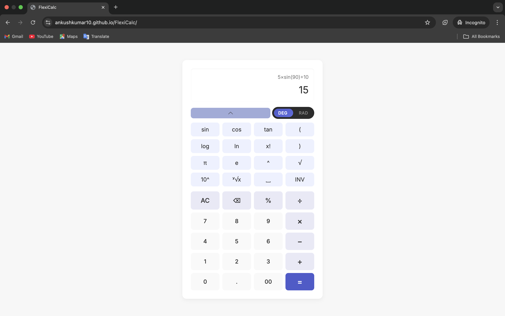
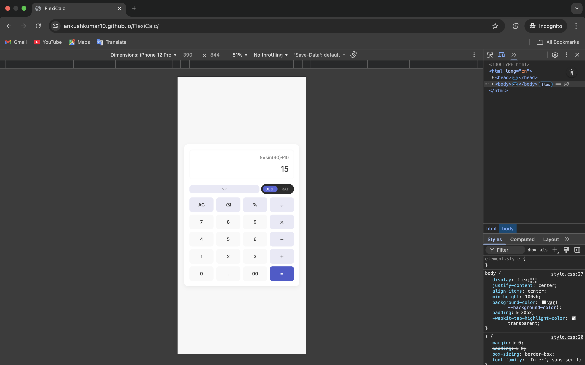
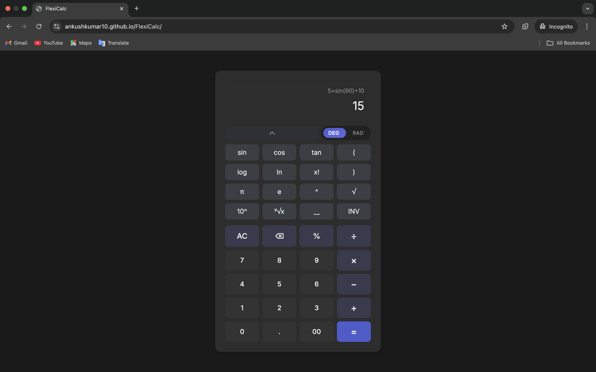
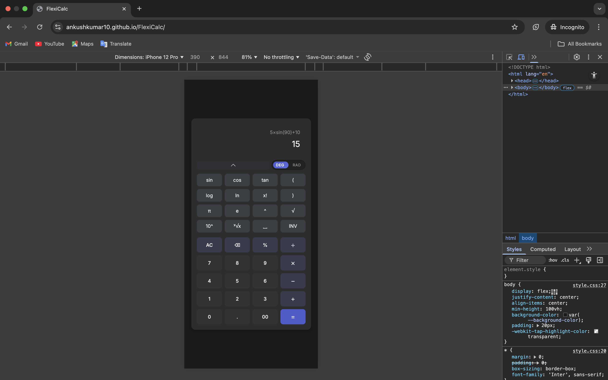

# 🔢 FlexiCalc — Advanced Scientific Calculator  
A modern, responsive, and feature-rich **scientific calculator** built using **HTML**, **CSS**, and **JavaScript**.  
FlexiCalc supports **trigonometry**, **inverse functions**, **logarithms**, **powers**, **nth roots**, **factorials**, **DEG/RAD switching**, and more.

---

## 🚀 Demo  
👉 **Live Demo:** *https://ankushkumar10.github.io/FlexiCalc/*

---

## ✨ Features

### 🎛 Core Calculator Features
- Basic arithmetic operations  
- Percentage calculation  
- Supports parentheses  
- Smooth button interactions  
- Keyboard support  

### 🧮 Scientific Functions
- sin, cos, tan  
- sin⁻¹, cos⁻¹, tan⁻¹ (via INV toggle)  
- Degrees/Radians mode  
- log, ln  
- Square root (√)  
- nth root (ʸ√x)  
- Power operations (^, 10^)  
- π and e constants  
- Factorial (x!)  

### 🎨 UI/UX Features
- Clean modern UI  
- Responsive design (mobile friendly)  
- Collapsible scientific keypad (advanced panel)  
- Smooth animations  
- Custom toggle switch for DEG/RAD  
- Dark mode support (via system theme)  

---

## 🖼️ Screenshots

|  Desktop View  |  Mobile View  |
|-----------|-----------|
|  |  |
|  |  |

---

## 🛠️ Tech Stack

| Technology | Purpose |
|-----------|---------|
| **HTML**  | Structure of the calculator UI |
| **CSS**   | Styling, layout, responsiveness, animations |
| **JavaScript** | Calculator logic and interaction |
| **Math.js** | Handling scientific operations reliably |

---

## 📌 Usage Guide

▶ Basic Usage
- Click buttons to input numbers and operators
- Press = to evaluate
- Use AC to clear
- Use ⌫ to delete one character
- Keyboard input is supported

▶ Scientific Controls

🔁 INV Button
- Toggles between:
- sin ↔ sin⁻¹
- cos ↔ cos⁻¹
- tan ↔ tan⁻¹

📐 Angle Mode
Toggle between DEG (degrees) and RAD (radians).

📉 Collapsible Panel
Click the arrow button to show/hide scientific keys, making it ideal for mobile.

---

## 🧪 Error Handling

FlexiCalc displays clean error messages for:
	•	Invalid math input
	•	Out-of-domain inverse trig functions
	•	Division by zero
	•	Improper expressions

The calculator resets automatically after displaying an error.

---

## 💬 Feedback

If you like this project, please ⭐ the repository!
If you have suggestions for new features, feel free to open an issue.

---

🔥 Created by Ankush Kumar

FlexiCalc — The Flexible, Modern Scientific Calculator
